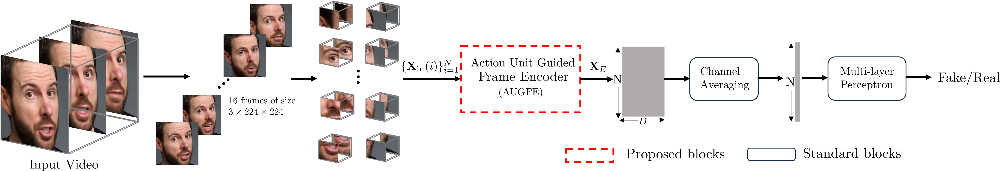

# Detecting Localized Deepfake Manipulations Using Action Unit-Guided Video Representations
# Paper is currently under review(Training code will be released upon acceptance)



## Setup
```
conda create -n deepfakedet --y python=3.12
conda activate deepfakedet
pip install -r requirements.txt 
```
## Weights and test videos
```
# Download weights from https://drive.google.com/file/d/10sfu8DQAAREGHB22lmRlsmiFSeaYazKl/view?usp=drive_link  and place in weights/
# Place shape extractor models from https://drive.google.com/file/d/10udhYxUdSnT1qbGIm9064YBBszvnJ1U-/view?usp=drive_link and place in weights/
# Place test videos in assets/videos/ 
```

## Inference
```
# Detect videos as fake or real with probability
python inference.py --video_path assets/videos


```
